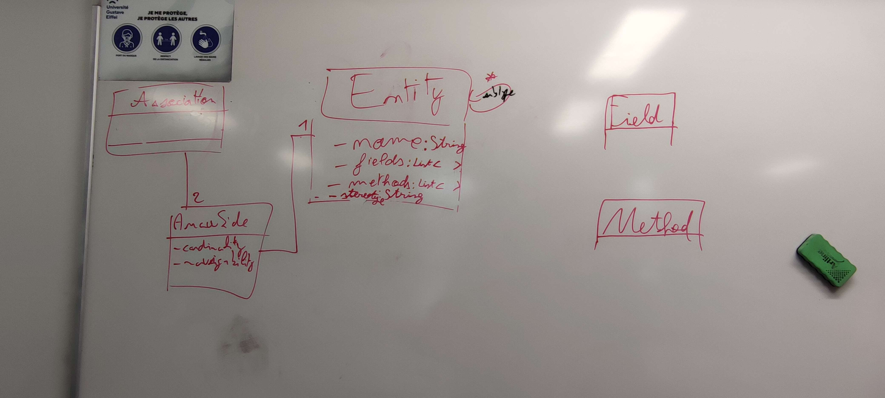
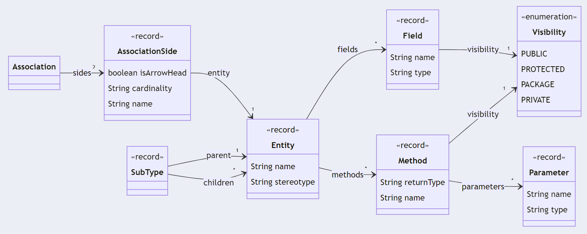
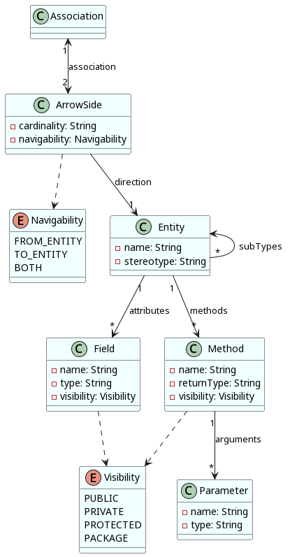
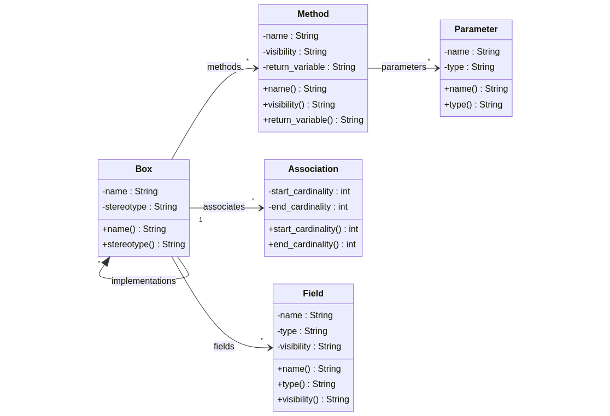
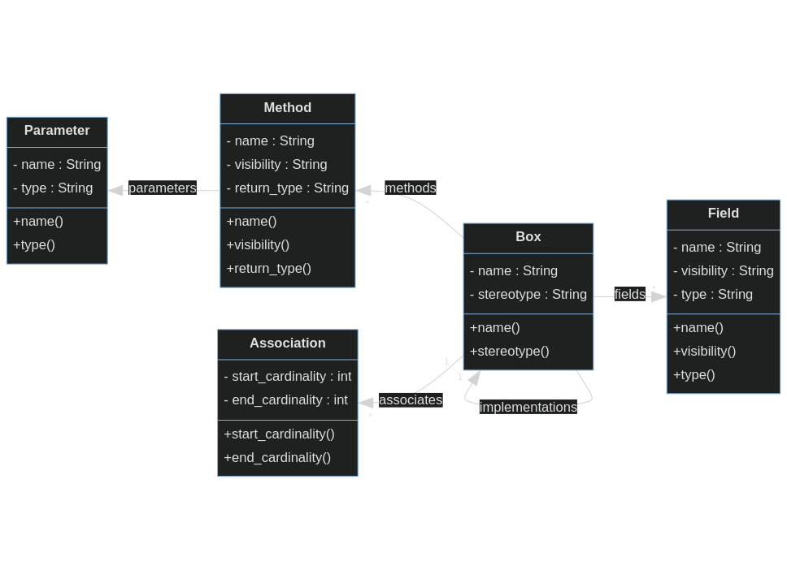
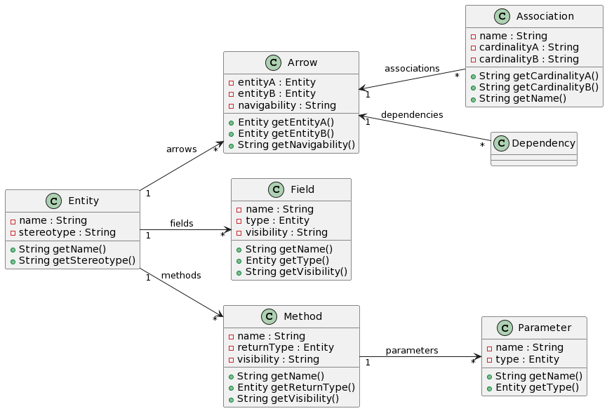
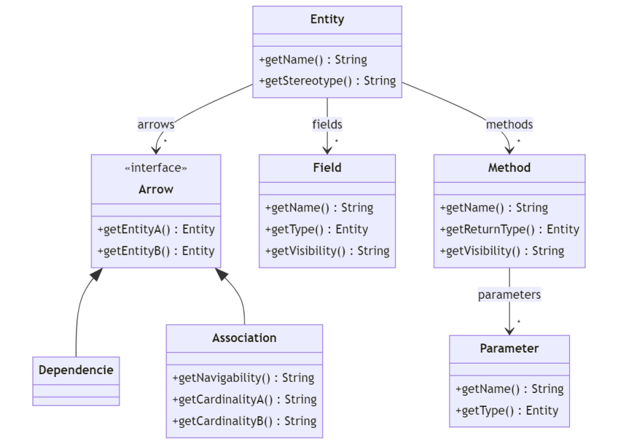

## Session 1 (27th of September 2022)

Try to model the classes necessary to represent a class diagram using blackboards

### Esteban - Thomas (VL)

**Mermaid**

### Brian - Axel

**Mermaid**

**PlantUML**

### Léo - Adrien

### Marius - Thomas (VX)

**PlantUML**

**Mermaid**

