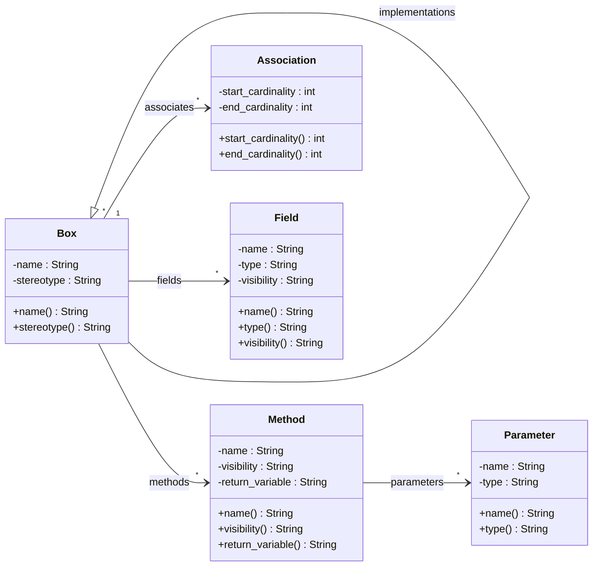

```mermaid
classDiagram
    direction LR
    Box "*" <|-- Box : implementations
    Box --> "*" Method : methods
    Box "1" --> "*" Association : associates
    Box --> "*" Field : fields
    Method --> "*" Parameter : parameters
    class Box {
        -name : String
        -stereotype : String
        +name() String
        +stereotype() String
    }
    class Association {
        -start_cardinality : int
        -end_cardinality : int
        +start_cardinality() int
        +end_cardinality() int
    }
    class Field {
        -name : String
        -type : String
        -visibility : String
        +name() String
        +type() String
        +visibility() String
    }
    class Method {
        -name : String
        -visibility : String
        -return_variable : String
        +name() String
        +visibility() String
        +return_variable() String
    }
    class Parameter {
        -name : String
        -type : String
        +name() String
        +type() String
    }

```