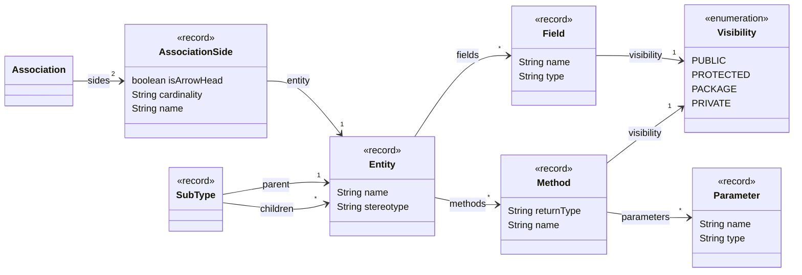

```mermaid
classDiagram
    direction LR
    Entity --> "*" Field : fields
    Entity --> "*" Method : methods
    Field --> "1" Visibility : visibility
    Method --> "1" Visibility : visibility
    Method --> "*" Parameter : parameters
    AssociationSide --> "1" Entity : entity
    Association --> "2" AssociationSide : sides
    SubType --> "1" Entity : parent
    SubType --> "*" Entity : children

    class Entity {
        <<record>>
        String name
        String stereotype
    }

    class Visibility {
        <<enumeration>>
        PUBLIC
        PROTECTED
        PACKAGE
        PRIVATE
    }

    class Field {
        <<record>>
        String name
        String type
    }

    class Method {
        <<record>>
        String returnType
        String name
    }

    class Parameter {
        <<record>>
        String name
        String type
    }

    class AssociationSide {
        <<record>>
        boolean isArrowHead
        String cardinality
        String name
    }

    class Association {
    }

    class SubType {
        <<record>>
    }
```