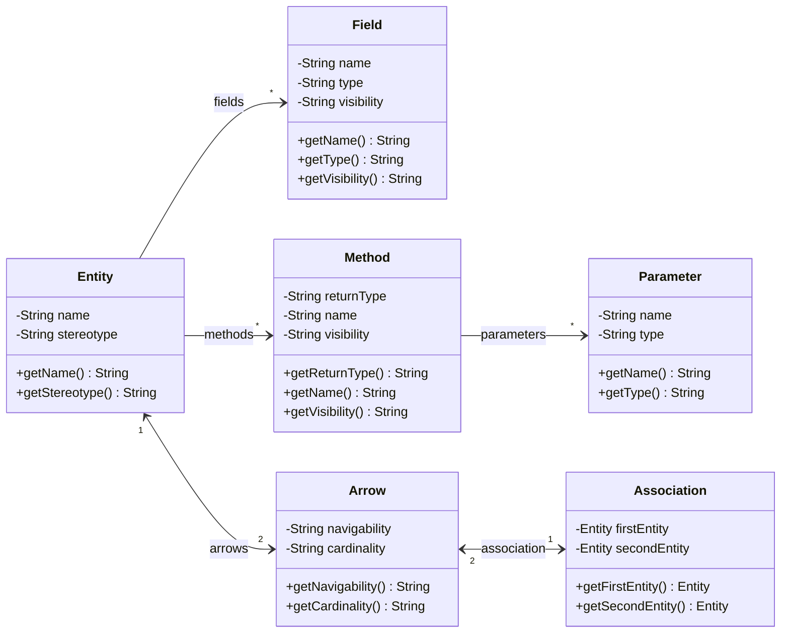

```mermaid
classDiagram
    direction LR
    Entity --> "*" Field : fields
    Entity --> "*" Method : methods
    Method --> "*" Parameter : parameters
    Entity "1" <--> "2" Arrow : arrows
    Arrow "2" <--> "1" Association : association

    class Entity {
        -String name
        -String stereotype
        +getName() String
        +getStereotype() String
    }

    class Field {
        -String name
        -String type
        -String visibility
        +getName() String
        +getType() String
        +getVisibility() String
    }

    class Method {
        -String returnType
        -String name
        -String visibility
        +getReturnType() String
        +getName() String
        +getVisibility() String
    }

    class Parameter {
        -String name
        -String type
        +getName() String
        +getType() String
    }

    class Arrow {
        -String navigability
        -String cardinality
        +getNavigability() String
        +getCardinality() String
    }

    class Association {
        -Entity firstEntity
        -Entity secondEntity
        +getFirstEntity() Entity
        +getSecondEntity() Entity
    }
```
