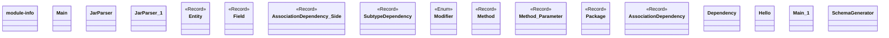

```mermaid
%% umldoc
classDiagram
	direction TB
	class module-info{
	}

	class Main{
	}

	class JarParser{
	}

	class JarParser_1{
	}

	class Entity{
		<<Record>>
	}

	class Field{
		<<Record>>
	}

	class AssociationDependency_Side{
		<<Record>>
	}

	class SubtypeDependency{
		<<Record>>
	}

	class Modifier{
		<<Enum>>
	}

	class Method{
		<<Record>>
	}

	class Method_Parameter{
		<<Record>>
	}

	class Package{
		<<Record>>
	}

	class AssociationDependency{
		<<Record>>
	}

	class Dependency{
	}

	class Hello{
	}

	class Main{
	}

	class Main_1{
	}

	class Main{
	}

	class SchemaGenerator{
	}

```
