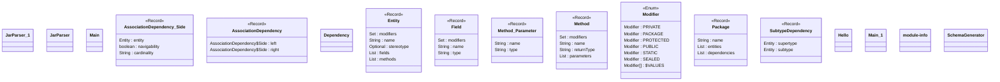

```mermaid
%% umldoc
classDiagram
	direction TB
	class JarParser_1{
	}

	class JarParser{
	}

	class Main{
	}

	class AssociationDependency_Side{
		<<Record>>
		Entity : entity
		boolean : navigability
		String : cardinality
	}

	class AssociationDependency{
		<<Record>>
		AssociationDependency$Side : left
		AssociationDependency$Side : right
	}

	class Dependency{
	}

	class Entity{
		<<Record>>
		Set : modifiers
		String : name
		Optional : stereotype
		List : fields
		List : methods
	}

	class Field{
		<<Record>>
		Set : modifiers
		String : name
		String : type
	}

	class Method_Parameter{
		<<Record>>
		String : name
		String : type
	}

	class Method{
		<<Record>>
		Set : modifiers
		String : name
		String : returnType
		List : parameters
	}

	class Modifier{
		<<Enum>>
		Modifier : PRIVATE
		Modifier : PACKAGE
		Modifier : PROTECTED
		Modifier : PUBLIC
		Modifier : STATIC
		Modifier : SEALED
		Modifier[] : $VALUES
	}

	class Package{
		<<Record>>
		String : name
		List : entities
		List : dependencies
	}

	class SubtypeDependency{
		<<Record>>
		Entity : supertype
		Entity : subtype
	}

	class Hello{
	}

	class Main_1{
	}

	class Main{
	}

	class module-info{
	}

	class Main{
	}

	class SchemaGenerator{
	}

```
