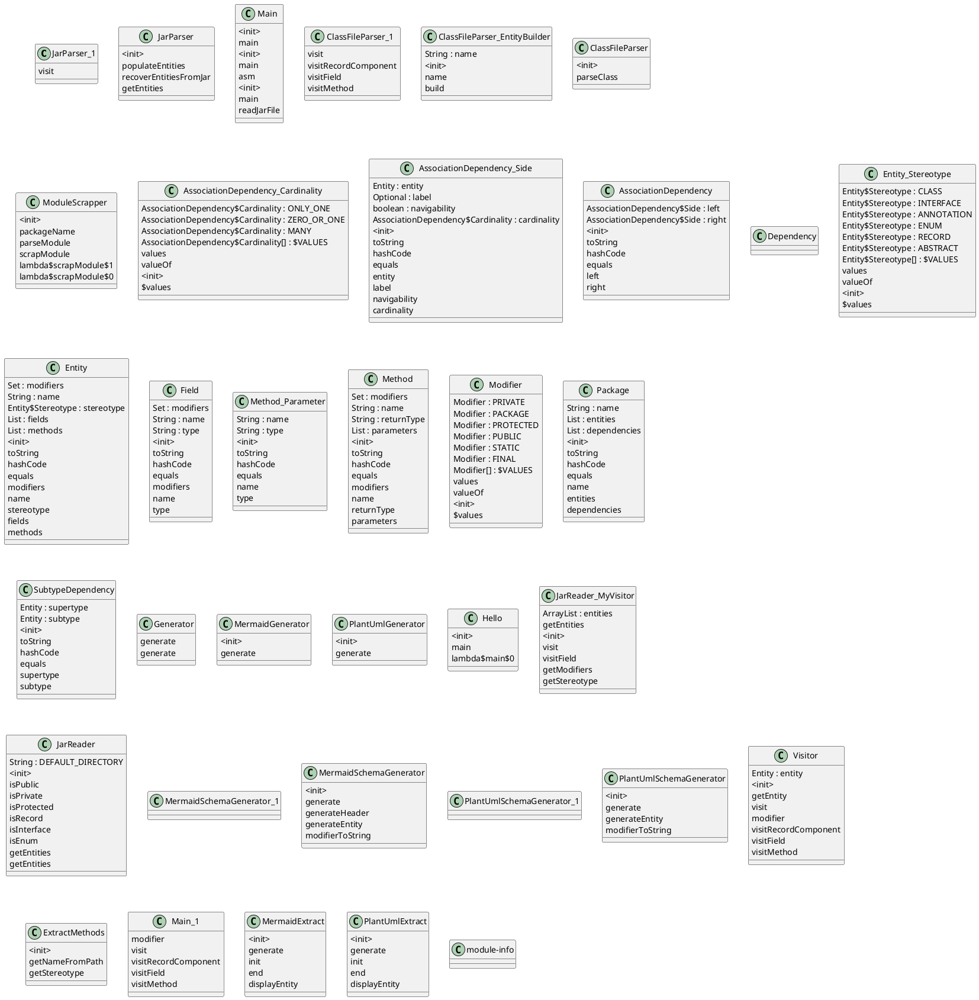

```plantuml
@startuml
' umldoc
	class JarParser_1{
		visit
	}

	class JarParser{
		<init>
		populateEntities
		recoverEntitiesFromJar
		getEntities
	}

	class Main{
		<init>
		main
	}

	class ClassFileParser_1{
		visit
		visitRecordComponent
		visitField
		visitMethod
	}

	class ClassFileParser_EntityBuilder{
		String : name
		<init>
		name
		build
	}

	class ClassFileParser{
		<init>
		parseClass
	}

	class ModuleScrapper{
		<init>
		packageName
		parseModule
		scrapModule
		lambda$scrapModule$1
		lambda$scrapModule$0
	}

	class AssociationDependency_Cardinality{
		AssociationDependency$Cardinality : ONLY_ONE
		AssociationDependency$Cardinality : ZERO_OR_ONE
		AssociationDependency$Cardinality : MANY
		AssociationDependency$Cardinality[] : $VALUES
		values
		valueOf
		<init>
		$values
	}

	class AssociationDependency_Side{
		Entity : entity
		Optional : label
		boolean : navigability
		AssociationDependency$Cardinality : cardinality
		<init>
		toString
		hashCode
		equals
		entity
		label
		navigability
		cardinality
	}

	class AssociationDependency{
		AssociationDependency$Side : left
		AssociationDependency$Side : right
		<init>
		toString
		hashCode
		equals
		left
		right
	}

	class Dependency{
	}

	class Entity_Stereotype{
		Entity$Stereotype : CLASS
		Entity$Stereotype : INTERFACE
		Entity$Stereotype : ANNOTATION
		Entity$Stereotype : ENUM
		Entity$Stereotype : RECORD
		Entity$Stereotype : ABSTRACT
		Entity$Stereotype[] : $VALUES
		values
		valueOf
		<init>
		$values
	}

	class Entity{
		Set : modifiers
		String : name
		Entity$Stereotype : stereotype
		List : fields
		List : methods
		<init>
		toString
		hashCode
		equals
		modifiers
		name
		stereotype
		fields
		methods
	}

	class Field{
		Set : modifiers
		String : name
		String : type
		<init>
		toString
		hashCode
		equals
		modifiers
		name
		type
	}

	class Method_Parameter{
		String : name
		String : type
		<init>
		toString
		hashCode
		equals
		name
		type
	}

	class Method{
		Set : modifiers
		String : name
		String : returnType
		List : parameters
		<init>
		toString
		hashCode
		equals
		modifiers
		name
		returnType
		parameters
	}

	class Modifier{
		Modifier : PRIVATE
		Modifier : PACKAGE
		Modifier : PROTECTED
		Modifier : PUBLIC
		Modifier : STATIC
		Modifier : FINAL
		Modifier[] : $VALUES
		values
		valueOf
		<init>
		$values
	}

	class Package{
		String : name
		List : entities
		List : dependencies
		<init>
		toString
		hashCode
		equals
		name
		entities
		dependencies
	}

	class SubtypeDependency{
		Entity : supertype
		Entity : subtype
		<init>
		toString
		hashCode
		equals
		supertype
		subtype
	}

	class Generator{
		generate
	}

	class MermaidGenerator{
		<init>
		generate
	}

	class PlantUmlGenerator{
		<init>
		generate
	}

	class Hello{
		<init>
		main
		lambda$main$0
	}

	class JarReader_MyVisitor{
		ArrayList : entities
		getEntities
		<init>
		visit
		visitField
		getModifiers
		getStereotype
	}

	class JarReader{
		String : DEFAULT_DIRECTORY
		<init>
		isPublic
		isPrivate
		isProtected
		isRecord
		isInterface
		isEnum
		getEntities
		getEntities
	}

	class Generator{
		generate
	}

	class MermaidSchemaGenerator_1{
	}

	class MermaidSchemaGenerator{
		<init>
		generate
		generateHeader
		generateEntity
		modifierToString
	}

	class PlantUmlSchemaGenerator_1{
	}

	class PlantUmlSchemaGenerator{
		<init>
		generate
		generateEntity
		modifierToString
	}

	class Main{
		<init>
		main
		asm
	}

	class Visitor{
		Entity : entity
		<init>
		getEntity
		visit
		modifier
		visitRecordComponent
		visitField
		visitMethod
	}

	class ExtractMethods{
		<init>
		getNameFromPath
		getStereotype
	}

	class Main_1{
		modifier
		visit
		visitRecordComponent
		visitField
		visitMethod
	}

	class Main{
		<init>
		main
		readJarFile
	}

	class MermaidExtract{
		<init>
		generate
		init
		end
		displayEntity
	}

	class PlantUmlExtract{
		<init>
		generate
		init
		end
		displayEntity
	}

	class module-info{
	}

@enduml
```
